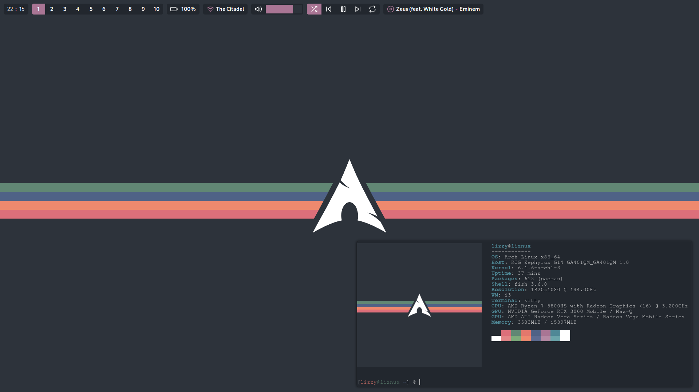

# My Dotfiles
Collection of my linux system configs.

> **Note** Use at your own risk, I am not responsible if you fuck up.

## Screnshots

## Installation & Software used
Below is the software I use and how to get it. Run the included [install script
](install.sh) to install all these dependencies as well as copy the required 
config files to their respective locations.

**Packages:**
| Package               | Description                               |
| --------------------: | ----------------------------------------- |
| `fish`                | Shell                                     |
| `kitty`               | Terminal                                  |
| `i3-gaps-rounded-git` | WM. On the AUR                            |
| `picom-ibhagwan-git`  | Compositor. On the AUR                    | 
| `neofetch`            | System stats in terminal                  |
| `spectacle`           | Screenshot tool. I wrote a custom wrapper |
| `firefox`             | Browser                                   |
| `feh`                 | Used to set wallpaper                     |
| `dmenu`               | Launcher                                  |
| `xclip`               | For manipulating the clipboard            |

### Neofetch
Pretty system information with distro art or images. To install, run `pacman -S
neofetch`.

### Spectacle
My preferred screenshot tool. To install, run `pacman -S spectacle`. I use a
custom wrapper script to upload resulting screenshots to an image host, which
has not been included in this repo as it is specialized for a private host.

## License
This code is licensed under the [MIT License](LICENSE), Copyright 2022 Elizabeth Hazel Ainslie.
