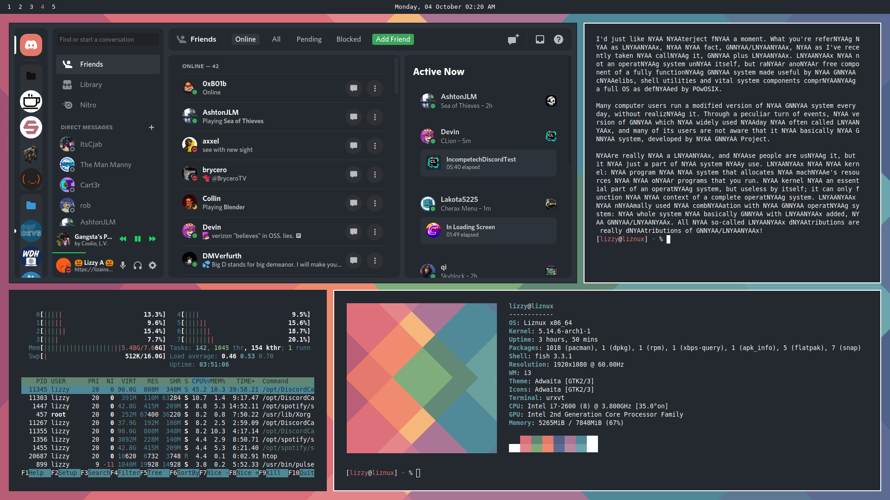

# My Dotfiles
> Use at your own risk. I am not responsible if you fuck up.

## Software Used

All of the following Linux tools can be found on the Arch Repos or the AUR. I use `yay`.
- `i3-gaps` - Window manager
- `neofetch` - Pretty system info in bash
- `fish` - Shell
- `polybar` - Bar
- `dmenu` - Application Launcher
- `ranger` - Terminal File Manager
- `w3m` - Images in terminal
- `urxvt` - Terminal
- `htop` - Process monitoring
- `flameshot` - Screenshot tool

Other Tools:
- `discord-canary` - Discord, but Canary because it has latest features and because I use Powercord. On the AUR.
- Powercord - Follow the installation guide at https://powercord.dev. My theme is in `powercord/src/Powercord/themes/lizzy`. Use Powercord at your own risk. I am not responsible for your Discord account.
