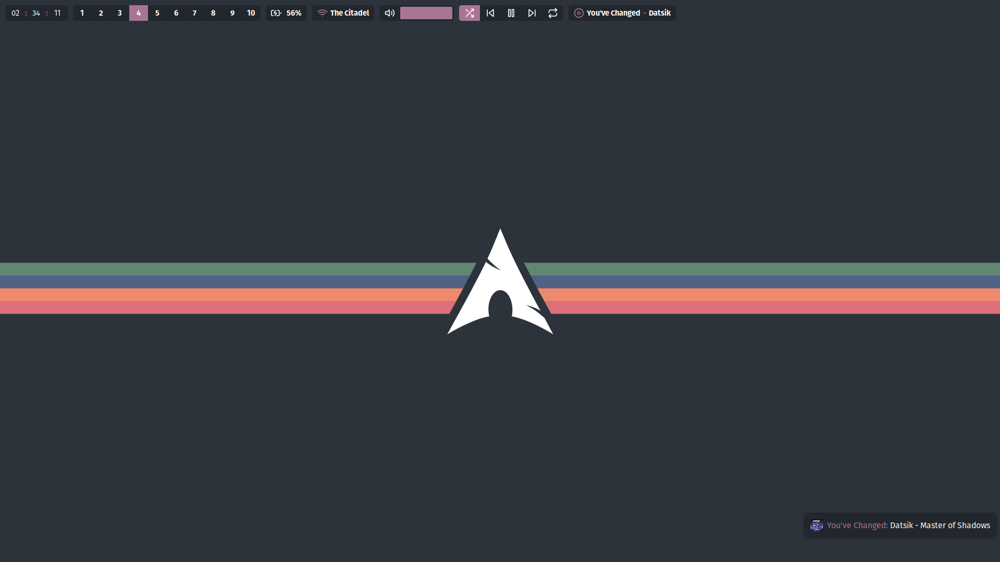
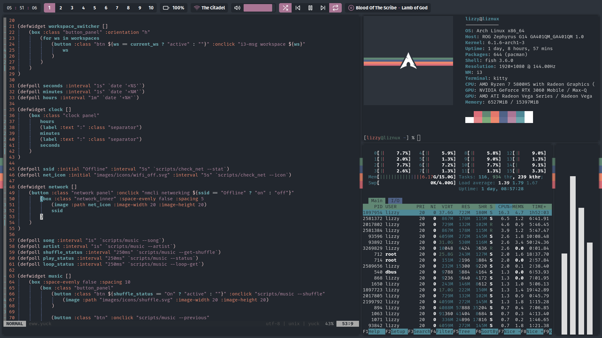
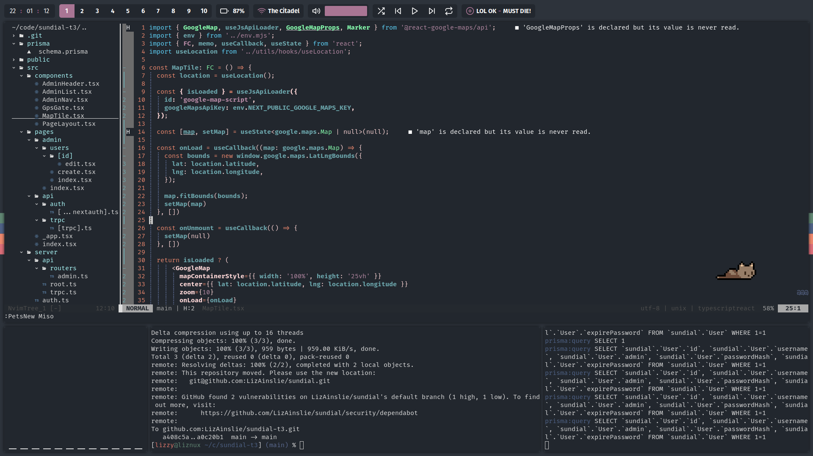

# My Dotfiles

Collection of my linux system configs.

> **Note** Use at your own risk, I am not responsible if you fuck up.

## Screnshots

## To be Paired With...

- [My Startpage](https://github.com/LizAinslie/startpage)
- [My Firefox Theme](https://github.com/LizAinslie/rice-firefox-theme)
- [My Discord Theme](https://github.com/LizAinslie/rice-discord-theme)
- [My Website Styles](https://github.com/LizAinslie/rice-browser-userstyles)

## Installation & Software used

Below is the software I use and how to get it. Run the included [install script
](install.sh) to copy the required
config files to their respective locations.

**Packages:**
| Package | Description |
| --: | --- |
| `fish` | Shell |
| `kitty` | Terminal |
| `i3-gaps-rounded-git` | WM. On the AUR |
| `picom-ibhagwan-git` | Compositor. On the AUR |
| `neofetch` | System stats in terminal |
| `spectacle` | Screenshot tool. I wrote a custom wrapper |
| `firefox` | Browser |
| `feh` | Used to set wallpaper |
| `dmenu` | Launcher |
| `xclip` | For manipulating the clipboard |
| `dunst` | Notification daemon |
| `neovim` | Vim, a text editor |
| `cava` | Terminal oscilloscope graph. On the AUR |
| `eww` | The "bar" |
| `ttf-firacode-nerd` | Patched Fira Code for nvim-tree |

**Recommended Fonts:**
- Fira Sans
- Fira Mono
- Fira Code

## License

This code is licensed under the [MIT License](LICENSE), Copyright 2023 Elizabeth Hazel Ainslie.
